<div align="center">
  

  # Oma-Netz Presentation

  **Interaktive Slide-Präsentation für das Oma-Netz Projekt**

  [](https://oma-netz-presentation.onrender.com)
  [](https://oma-netz-final-project-valerija-yev.vercel.app/landing)
  [](https://github.com/Yevhenii1951/Oma-Netz_Presentation)
  [](https://github.com/Yevhenii1951/Oma_netz_final_project_Valerija_Yevhenii)

  
  
  
  
  
  
  

</div>

---

<p align="center">
  <a href="#about">About</a> •
  <a href="#slides">Slides</a> •
  <a href="#tech-stack">Tech Stack</a> •
  <a href="#getting-started">Getting Started</a> •
  <a href="#project-structure">Structure</a> •
  <a href="#presentation-script">Script</a>
</p>

---

## 🎯 About

This is the **interactive presentation** for the [Oma-Netz](https://github.com/Yevhenii1951/Oma_netz_final_project_Valerija_Yevhenii) project — a neighborhood-help platform connecting seniors with volunteers in Kassel, Germany.

Built as a single-page slide deck using **Vite + React + TypeScript**, it walks through the entire project journey:

- The problem and target audience
- Planning process (Excalidraw, User Stories)
- Live product demo with real screenshots
- System architecture (Next.js, Prisma, PostgreSQL)
- Code walkthrough (Prisma schema, React forms, API routes)
- Key learnings and next steps

> **Live:** [oma-netz-presentation.onrender.com](https://oma-netz-presentation.onrender.com)

---

## 📑 Slides

<table>
  <tr>
    <td>
      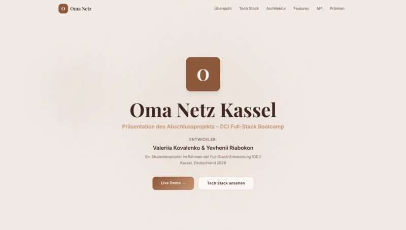
      <br /><sub>Hero / Intro</sub>
    </td>
    <td>
      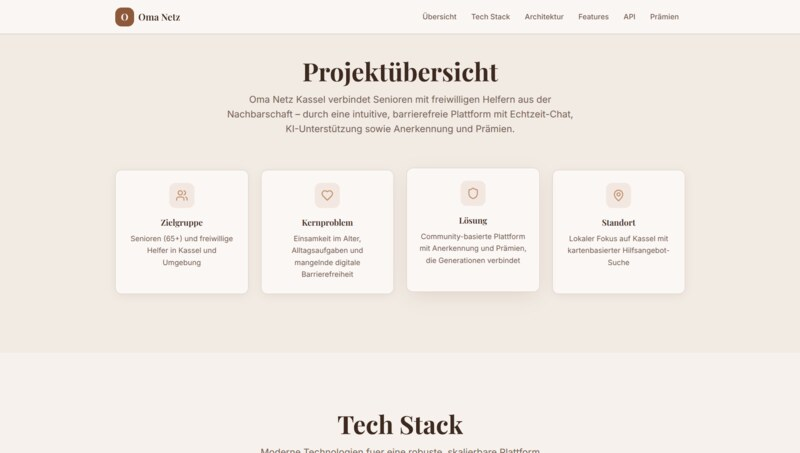
      <br /><sub>Overview</sub>
    </td>
    <td>
      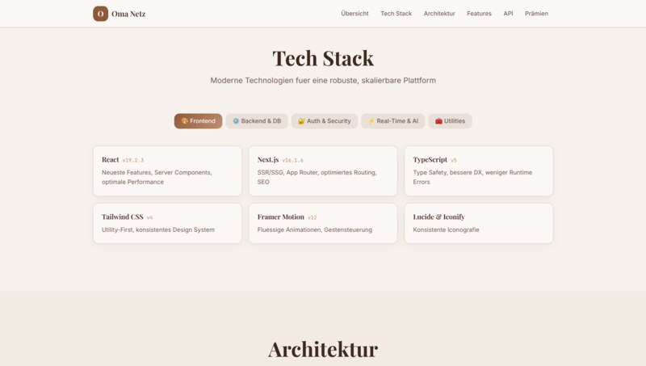
      <br /><sub>Features</sub>
    </td>
  </tr>
  <tr>
    <td>
      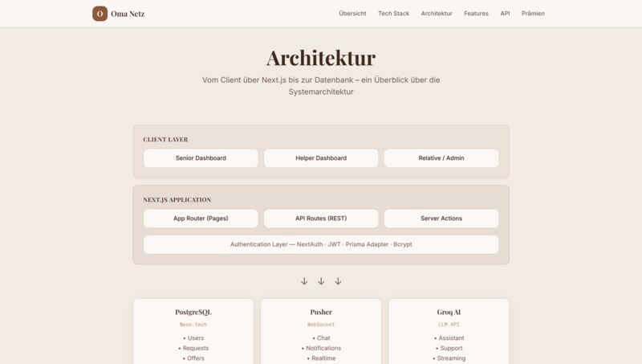
      <br /><sub>Tech Stack</sub>
    </td>
    <td>
      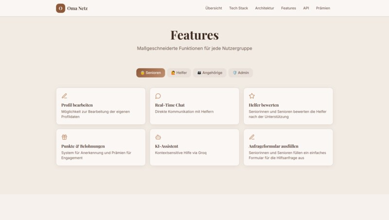
      <br /><sub>Architecture</sub>
    </td>
    <td>
      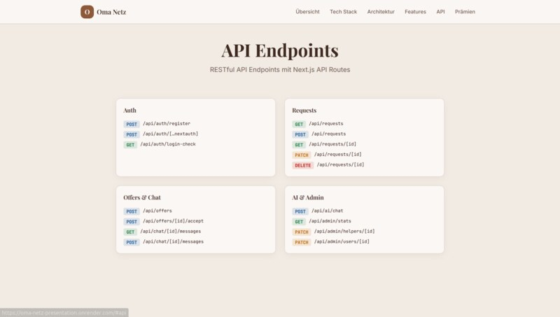
      <br /><sub>Authentication</sub>
    </td>
  </tr>
  <tr>
    <td>
      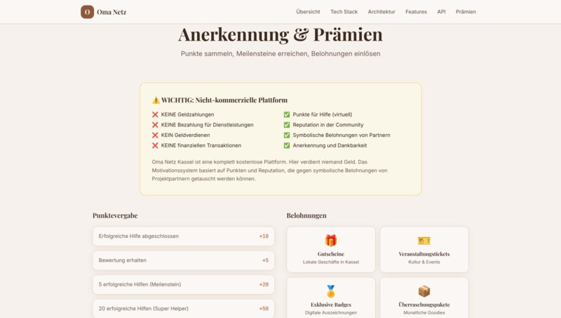
      <br /><sub>API & Endpoints</sub>
    </td>
    <td>
      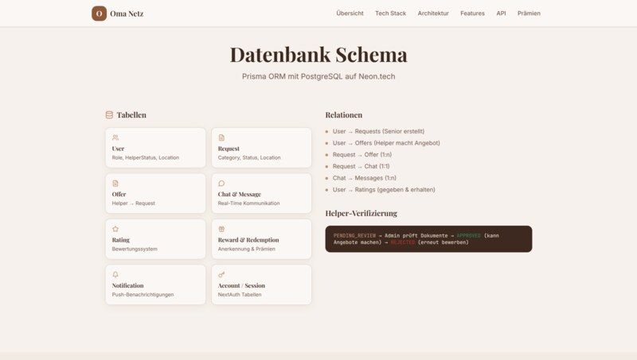
      <br /><sub>Database Schema</sub>
    </td>
    <td>
      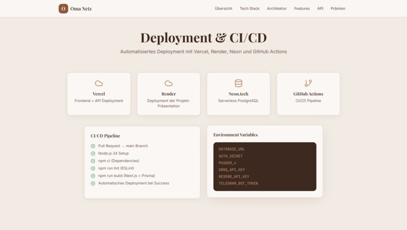
      <br /><sub>Gamification</sub>
    </td>
  </tr>
  <tr>
    <td>
      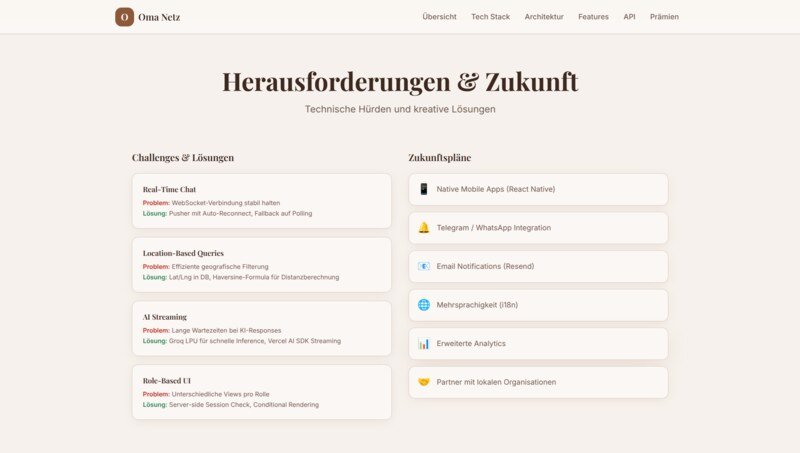
      <br /><sub>Deployment / CI/CD</sub>
    </td>
    <td>
      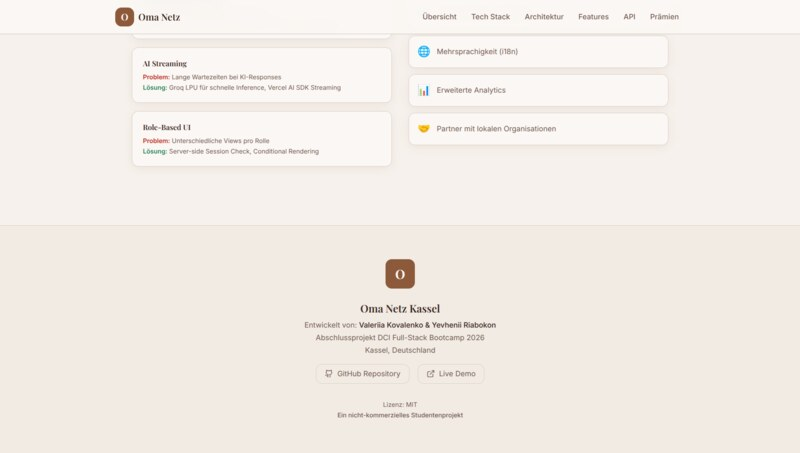
      <br /><sub>Challenges & Learnings</sub>
    </td>
    <td></td>
  </tr>
</table>

---

## 🛠️ Tech Stack

| Layer | Technology |
|-------|-----------|
| **Framework** | [Vite 6](https://vitejs.dev/) + [React 18](https://react.dev/) |
| **Language** | [TypeScript 5](https://www.typescriptlang.org/) |
| **Styling** | [Tailwind CSS 3](https://tailwindcss.com/) + [shadcn/ui](https://ui.shadcn.com/) components |
| **Animations** | [Framer Motion](https://www.framer.com/motion/) |
| **Icons** | [Lucide React](https://lucide.dev/) |
| **Charts** | [Recharts](https://recharts.org/) |
| **Routing** | [React Router DOM v6](https://reactrouter.com/) |
| **Testing** | [Vitest](https://vitest.dev/) (unit) + [Playwright](https://playwright.dev/) (e2e) |
| **State** | [TanStack React Query](https://tanstack.com/query/latest) |
| **Linting** | [ESLint 9](https://eslint.org/) |
| **Deployment** | [Render](https://render.com/) |

---

## 🚀 Getting Started

```bash
# Clone
git clone https://github.com/Yevhenii1951/Oma-Netz_Presentation.git
cd Oma-Netz_Presentation

# Install
npm install

# Dev server
npm run dev

# Build
npm run build

# Preview production build
npm run preview
```

### Testing

```bash
# Unit tests
npm run test

# Unit tests (watch mode)
npm run test:watch

# E2E tests (Playwright)
npx playwright test
```

---

## 📁 Project Structure

```
├── public/
│   ├── screenshorts_Readme/   # Screenshots + compressed versions
│   ├── favicon.svg
│   └── robots.txt
├── src/
│   ├── components/
│   │   ├── ui/                # shadcn/ui primitives
│   │   └── sections/          # Slide sections (Hero, Features, etc.)
│   ├── pages/
│   │   ├── Index.tsx           # Main presentation page
│   │   └── NotFound.tsx        # 404 fallback
│   ├── hooks/                  # Custom React hooks
│   ├── lib/                    # Utilities
│   ├── tests/                  # Test files
│   ├── App.tsx
│   ├── main.tsx
│   └── index.css
├── presentation-script.md      # Full presentation script (DE + RU)
├── playwright.config.ts
├── vitest.config.ts
└── vite.config.ts
```

---

## 📝 Presentation Script

The full two-language script is available at [`presentation-script.md`](presentation-script.md) covering:

| Section | Duration | Content |
|---------|----------|---------|
| Intro / Elevator Pitch | 0:30 | Problem statement + target audience |
| Planning | 2:00 | Excalidraw, User Stories, role overview |
| Product Demo | 5:00 | Registration → Request → Accept → Chat → Complete |
| Architecture | 2:00 | Next.js, Prisma, PostgreSQL, data flow |
| Code Demo | 3:00 | Prisma schema, React form, API route |
| Learnings | 2:00 | Challenges, insights, next steps |

---

## 👩‍💻 Authors

<div align="center">
  <table>
    <tr>
      <td align="center">
        <strong>Yevhenii Riabokon</strong><br />
        <a href="https://github.com/Yevhenii1951">@Yevhenii1951</a>
      </td>
      <td align="center">
        <strong>Valeriia Kovalenko</strong><br />
        <a href="https://github.com/Valerija2425">@Valerija2425</a>
      </td>
    </tr>
  </table>
  <br />
  <sub>DCI — Full-Stack Web Development Programm • 2025–2026</sub>
</div>

---

<div align="center">
  <a href="https://oma-netz-presentation.onrender.com">
    
  </a>
  <a href="https://oma-netz-final-project-valerija-yev.vercel.app/landing">
    
  </a>
  <br /><br />
  <sub>Mit ❤️ entwickelt in Kassel</sub>
</div>
